An idiot's guide to making 3D maps
======

I love old maps – partly because it’s always interesting to see how the world used to look, but mostly because they are just incredibly beautiful. So I’ve been really enjoying the work of [Sean Conway/@geo_spatialist](https://twitter.com/geo_spatialist) who combines vintage maps from all over the world with modern elevation data to create amazing 3D versions. I am also an idiot, but I try not to let that hold me back too much in life, so I thought it would be fun to try and create something similar. And somehow, it kind of works. This post is my attempt to explain this process so others can make their own maps like this. I’m going to try and describe it in a way that somebody who has never used any of the relevant bits of software before can understand. Hopefully.

**I cannot emphasise enough that what I’m describing here is pretty much the limit of my understanding of most of the pieces of software involved. There may well be better or more efficient ways to do some or all of this (and I’m keen to know how if you do!), but this is the process I’ve been using. **

To start with, you need 3 free bits of software: [QGIS](https://download.qgis.org/), [GIMP](https://www.gimp.org/downloads/) and [Aerialod](https://ephtracy.github.io/index.html?page=aerialod). You also (obviously) need a nice map. The map I’m using here came from the excellent collection at the [National Library of Scotland](https://maps.nls.uk/) (you do have to pay for high-resolution scans of many of their maps), but I’m sure there are lots of other resources out there – I made [this image](https://twitter.com/VictimOfMaths/status/1328270152543203328?s=20) using a free map [from Norway](https://www.geonorge.no/) (because of course Norway has an amazing open map library). The last thing you need is some elevation data. This will be from some kind of [DEM/DTM/DSM](https://gisgeography.com/dem-dsm-dtm-differences/). Unless your map is very small scale, or pretty recent, you probably want DTM/DEM, which doesn’t include buildings, since they may well have changed. There may be things which have changed over time in DTM/DEM data – digging quarries or creating reservoirs, but there’s not much we can do about that. If you have access to [Digimap](https://digimap.edina.ac.uk/), you can download Ordnance Survey’s 5m or 50m resolution DTM for the UK. You can also download LiDAR elevation data for [England](https://environment.data.gov.uk/DefraDataDownload/?Mode=survey), [Wales](http://lle.gov.wales/GridProducts#data=LidarCompositeDataset) or [Scotland](https://remotesensingdata.gov.scot/data#/map) for free. I’m sure other resources are available. All elevation data is calculated on a grid, of some resolution, from 25cm for really detailed LiDAR data to 50m for big, country-scale datasets. It’s useful to have data at an appropriate resolution – using 25cm data for a map of the whole of the UK will destroy our computer with the size of the file, while using 50m data for a map of your local town will make everything look rather Minecrafty. I reckon 50m is fine for the whole country, 5m is better for a single OS sheet or similar.

Assuming we have assembled everything, let’s begin.

#### **Step 1 – Assembling the two layers**

Elevation data usually comes in a load of separate files corresponding to grid squares. If your elevation data is already in a single file, then you can skip straight to step 2. Otherwise, open QGIS, open the folder you’ve downloaded your elevation data to, and drag all of your .asc files into a new project. For this example, I’ve downloaded OS 5m DTM data, which looks like this:

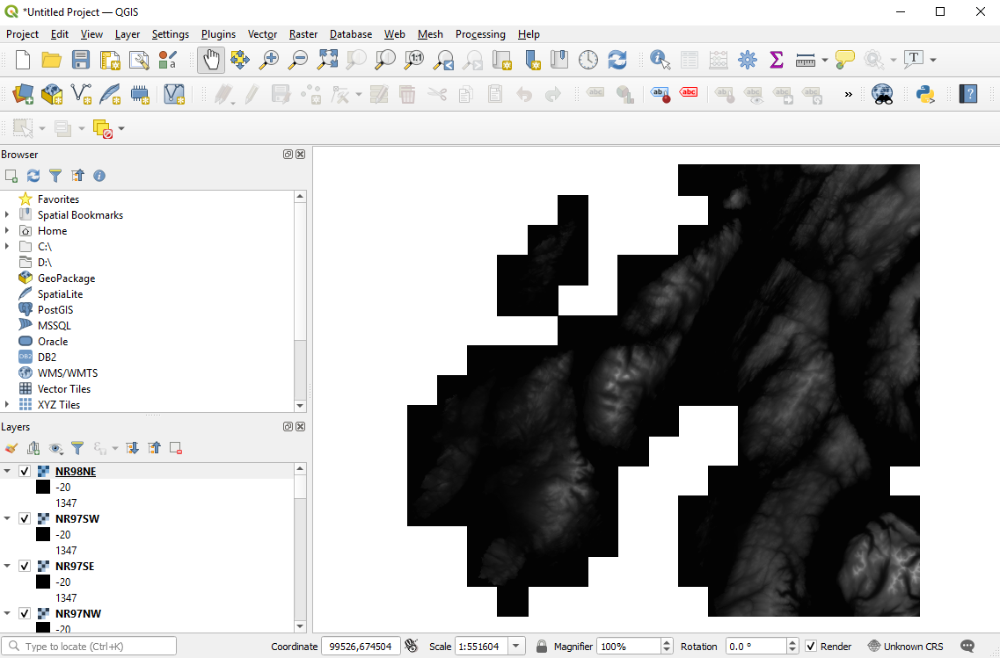

Where you have big relative elevation differences between squares, sometimes the squares won’t all be on the same scale and things will look blockier than this. Whether they are or not though, we need to join the squares into one single elevation file. We do this using the Merge function, which lives under Raster>Miscellaneous and brings up a box like this:

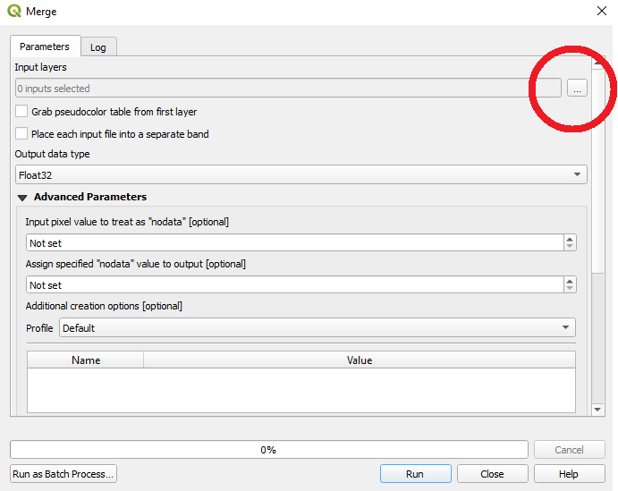

Click on the 3 dots highlighted above, then Select All, OK and then click the Run button with the snazzy blue outline. QGIS will have a bit of a think, but once it’s done you can close the Merge window and you should have a single, elevation file. 

If you want to save a copy you can use Project>Import/Export>Export Map to Image, which will bring up this interface:

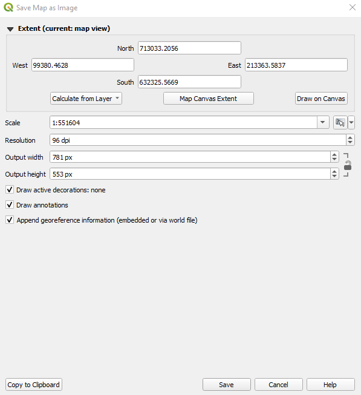

Select ‘Calculate from Layer’ and select the ‘Merged’ layer to automatically clip the boundaries to the edge of your merged elevation file. Or you can use ‘Draw on Canvas’ to just draw the bounding box you want. Than manually change the resolution to be as large as you can (the max is 3,000 dpi), while still keeping the Output Width and Height no larger than ~15,000 pixels (as Aerialod might get sad otherwise). Then just select Save to save a copy of the file as an image.

If you have downloaded multiple map tiles, then you can merge them using exactly the same process and save a copy of this.

#### **Step 2 – Reprojecting**

If you are lucky, your map and elevation data will use the same map projection, and you can skip straight onto step 3 (e.g. if you are using a post-WW2 OS map and OS DTM data). Unfortunately nice old maps often used weird map projections, in which case we will need to reproject our elevation data or it won’t align with our map. There are two options here:

i)          If you know what projections your map and elevation data are in (you need the EPSG codes) then you can use the Raster>Projections>Warp (Reproject) option in QGIS to translate your elevation data into the correct projection (OS maps are in EPSG 27700)

ii)          If you don’t know what projections are being used for at least one of the map or elevation data, or if you don’t know the EPSG codes (e.g. the 1901 Bartholomew’s map I’m using for this example used a Cassini projection centred on Delamere in Cheshire (obviously)) then you can manually reproject using the Georeferencer Plugin, which lives in the Raster menu.

First, save a copy of your merged elevation data, them open a new project in QGIS and drag your map into it. Then open Georeferencer

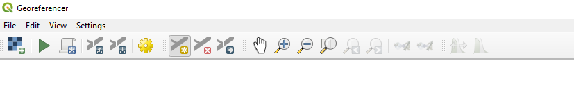

This will open a second window, which we need to import the elevation data into, using the checkerboard icon in the top left. Then comes the fun bit. You need to find at least 6 (the more the better really) points that you can identify on both the map and the elevation data. Distinctive coastal/river features, or the tops of mountains are usually a good bet. You want to ensure you have a good spread across the map canvas as well. For each one, choose the ‘Add point’ function  and click on the point on the elevation data. 

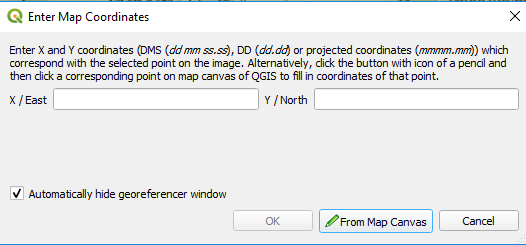

Then select ‘From Map Canvas’ and click on the equivalent point on your map, then click OK. Each point will turn into a red dot, so you end up with something like this:

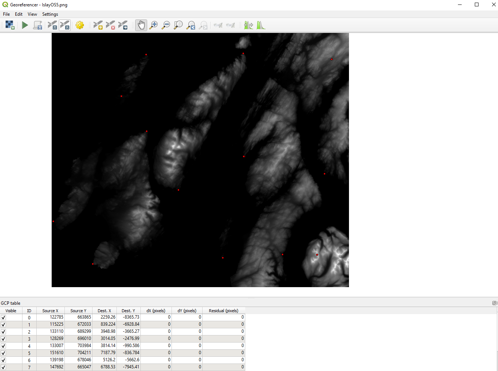

Next, click on the cog icon to open the ‘Transformation Settings’ box. Change the Transformation type to ‘Polynomial 2’, select the Target SRS as something sensible (27700 is a good bet for UK data) and chose a name for your reprojected file in the ‘Output raster’ box. Then click OK and press the green arrow in the top left of the Georeferencer window. This will magically reproject your elevation data so it aligns with your map. Hopefully.

#### Step 3 - Aligning (part 1)

The next step serves two purposes: Firstly to make sure your map and elevation data really do align properly and secondly to add any little flourishes you might want. Like adding a fancy bit of shading to your legend (totally unnecessary and quite faffy, but one of my favourite things about Sean Conway’s maps).

To do this, we’re going to need to open up GIMP, which is a very powerful image manipulation tool. It can be quite confusing, but we don’t need to do too much in it, so don’t be scared. 

Firstly, open up your elevation data, then, using File>Open as Layers, open your map on top of it. You should end up with something that looks like this. You can’t see the elevation data, because it’s obscured by the map, but you can see it there on the right hand side, and if you slide the ‘Opacity’ slider over there down a bit your elevation data starts to emerge.

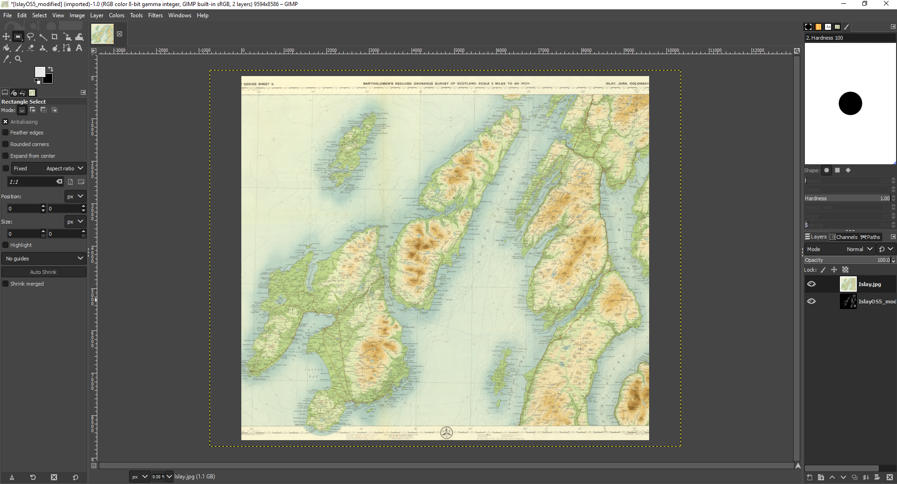

If you do this, you’ll see that the two layers aren’t aligned. So we need to fix that. To do this, bring up the ‘Scale’ tool, which lives under Tools>Transform Tools>Scale. Then through a combination of dragging the map to make it bigger/smaller, and moving it around (using the four squares in the middle), you need to line the two layers up. I’m not going to lie, this can be a *pain* sometimes, particularly if you didn’t get the reprojection right and they don’t line up at all (in which case it’s back to step 2 for another go). But it’s really worth spending the time faffing about to get this right. You can zoom in using the button down on the bottom left if you need a closer look. Hopefully you’ll eventually get something like this. You need to slide the opacity slider quite low, I find.

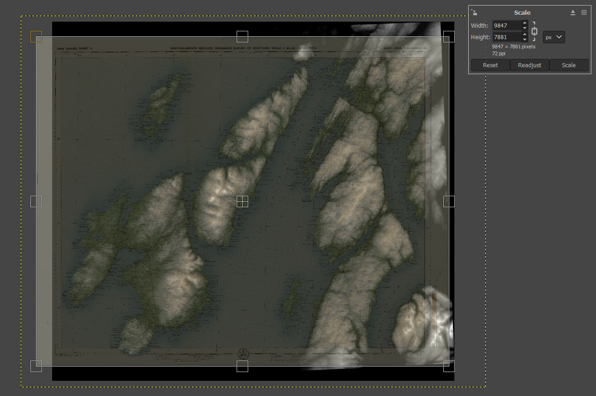

Once you’re happy, click on ‘Scale’ in that box in the top right. Next, we want to crop the elevation data to match up with the borders of the map. To do this, click on the elevation layer over there on the right hand side below the opacity slider. We’re now editing this layer. Assuming your map is rectangular, we can use the rectangle select tool to do this cropping – just press ‘R’ to bring this up and select the border of your map. Then press ‘Ctrl+I’ to invert the selection (so you’ve selected everything *outside* the box) and then ‘Ctrl+x’ to remove it. Bingo. If your map is a weird shape, there’s a freehand selection tool ‘F’ you can use instead.

That’s all you *need* to do, but if you want to pimp your legend, then this is the time to do it. We’re going to set up some nice shadows, like these:

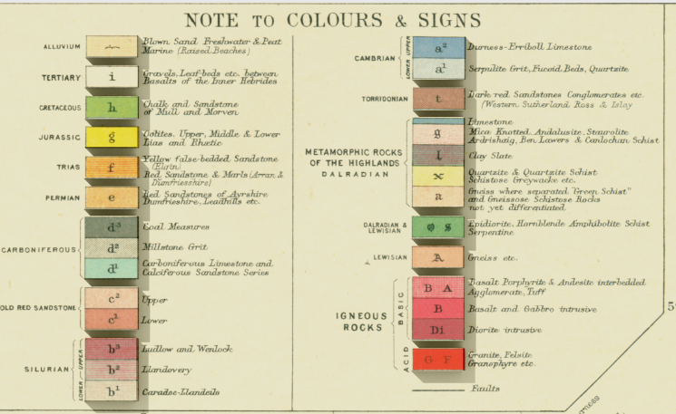

Find the legend, and highlight the first area you want to highlight (e.g. each one of these coloured boxes). Then find the ‘Bucket Fill’ tool up in the top left:

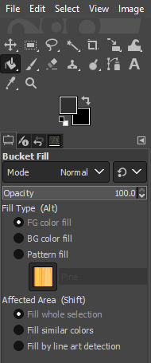

Set ‘Affected Area’ to ‘Fill whole selection’ and chose a dark grey colour by clicking on the top of those two overlapping squares. The lighter the grey, the bigger the lift you will give the legend (and the bigger the corresponding shadow). I think this works best as quite a subtle effect, so something like the example above works for me. Then just point your bucket at the highlighter area to fill it. You can check it’s worked by clicking back on the map layer and bringing the opacity down to 0 to see if there’s a nice highlighted square/rectangle. Repeat this until you are happy your legend is suitably beautiful. You can use the same trick to pick out any other features around the map if you so wish.

At this point, there’s something else cool that you can do, but I’ll come back to that at the end. For now, if we right click on the map layer and select ‘Delete Layer’ to leave us just with the elevation layer, with a few grey rectangles on it, like this:

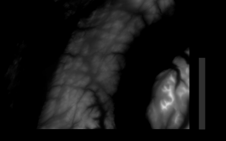

Now we’re ready to add shadows, so we need to export this file using File>Export As. Give it a name (make sure you use descriptive names, as it’s easy to end up getting confused with so many similar file versions kicking around) and click Export and Export again. Sometimes this can take a while.

#### Step 4 - Shading

Now for the real sorcery. Open Aerialod and use the open folder icon in the top right to open the file you just exported from GIMP. If you haven’t used Aerialod before then I *strongly* recommend the [excellent](http://www.statsmapsnpix.com/2019/11/amazing-3d-rendering-with-aerialod.html) [tutorials](http://www.statsmapsnpix.com/2020/03/making-3d-landscape-and-city-models.html) that [Alisdair Rae](https://twitter.com/undertheraedar) has put together. It’s an amazing tool you can use to create all kinds of wonderful 3D images. But if you don’t have time for that just now, then save that for later. You should see something like this:

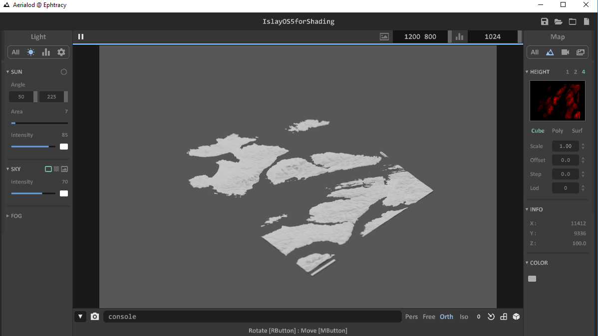

Our first task is to rotate the image so we are looking directly down on it and it’s aligned with the map (this is *really* important). You can use the right mouse button to drag the map around and then if you select the 3 squares next to each other in the bottom right, they bring up a couple of numbered tabs. You want these to say 0 and 90 respectively. If you are close and you click on one of the numbers, it will automatically bounce you to 0/90, which is dead handy. 

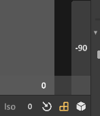

Next, we can slide use Scale parameter over on the right to increase the contrast in our elevation. How much you want to do this is entirely up to you, but it will also depend on how busy your map is (too many shadows will obscure some of that detail) and how much elevation contrast there is – if you just have one big mountain in the middle, you can really go to town, whereas if you’re mapping an entire mountain range, than you might want to tone it down a bit. I generally find somewhere between 5-10 works nicely.

Now you need to choose what direction you want the sun to come from using the cunningly named ‘Sun’ controls over on the left. The ‘Angle’ control gives you the angle of the sun above the horizon – this is set at 50 by default which I think is about right for this sort of application. The other number is the direction the sun comes from (using degrees, with 0/360 as South, so 180 is due North). Have a play around with this until you have some shadows you are happy with.

Finally, we need to make everything white, so the colours in the original map really pop. If you click ‘All’ under ‘Light’ on the left hand side and click on the little square denoting Ground Color, then make that white. This will change the sea/background colour to white. Then if you also click on the ‘Color’ square over on the right hand side and make that white too, you will end up with an image that only consists of the shadows. Perfect.

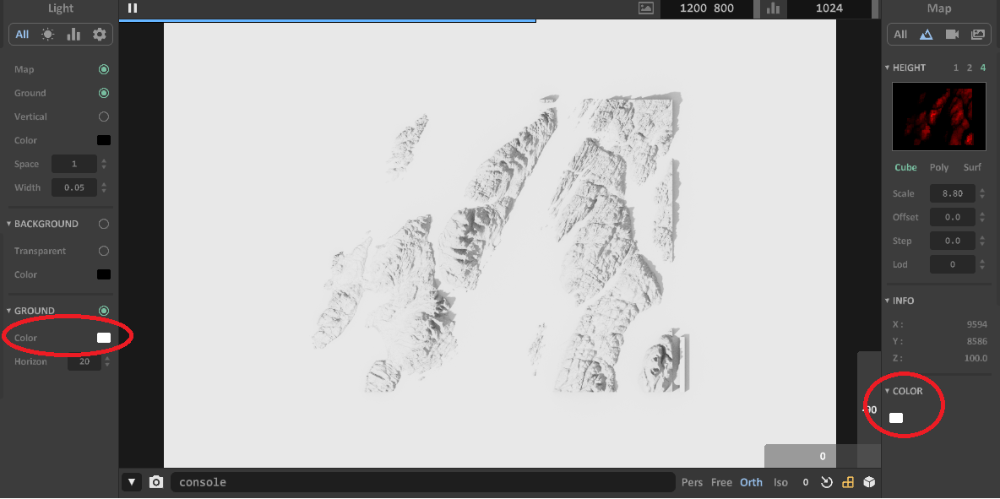

Then all we need to do is export it. Click on ‘All’ on the right hand side under map and scroll down to the ‘Render’ button. The ‘Width’ and ‘Height’ boxes above this control the size of the exported image, in pixels. Generally more is better, although it means the rendering can take a while. I find 8,000-10,000 works well. Then click ‘Render’ and give your file a (distinctive) name, and wait for it to render. Depending on how powerful your computer is, this can take a *long* time. Go and get a cup of tea. We’re nearly there.

#### Step 5 - Aligning (part 2)

The last task is to bring it all together. Open GIMP up again, open the file you just exported from Aerialod and then open your map as a layer on top of it. Using the Scale tool just like you did in Step 3, align the maps, making sure that your legend shadows line up nicely with the actual legend. Again, this is a faff, but it’s worth getting right. Once you’re happy and you’ve clicked ‘Scale’ to actually rescale the map, you can whack the Opacity slider back up to 100. 

Now for the magic. Just above the Opacity slider is a ‘Mode’ option, which is currently set to ‘Normal’. Change this to ‘Linear burn’ and, as if by magic, a 3D map will appear. Once you have stopped feeling smug about how awesome you are for making this, you just need to select Layer>Merge Down to combine your layers into a single image, and then export this using File>Export as.

AND THAT’S IT. 

Time for tea and medals.

Oh, I did say there was something else cool you could do, didn’t I? 

Well, at the end of Step 3, if instead of deleting the map layer, you change the Mode to Linear Burn at that stage, then Merge Down the layers and export this merged image, you’ll have something like this (yes, it looks a bit weird, but bear with me):

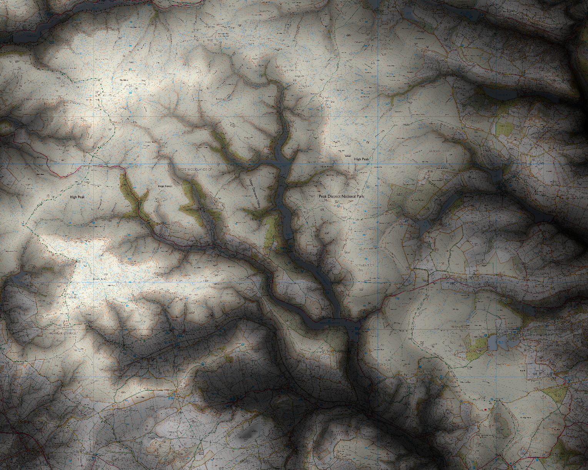

If you import this strange creature into Aerialod, then hopefully it will start to make sense. Elevation is encoded as darkness/lightness of colour, so as well as the true elevation from the elevation layer, all of the detail from the original map gets converted to elevation data, meaning the contour lines and annotations appear to be incised into the ground.

Some things look a bt strange (particularly forests and lakes with depth data), but overall I think this is a pretty cool way of looking at maps. With a bit of playing around with the settings in Aerialod you can make images like this one, which I think is rather nice.

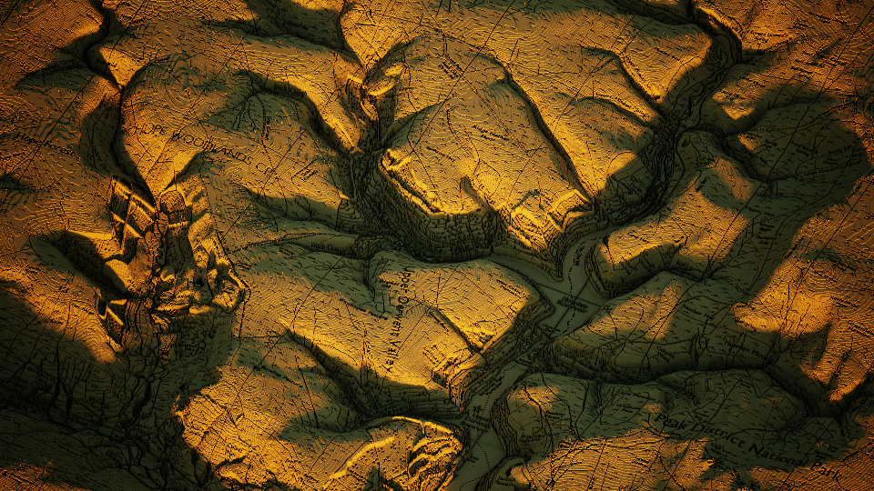

All elevation data and Ordnance Survey maps © Crown copyright and database rights [Ordnance Survey](https://www.ordnancesurvey.co.uk/) (100002525)

Original Bartholomew's map reproduced with the permission of the [National Library of Scotland](https://maps.nls.uk/)